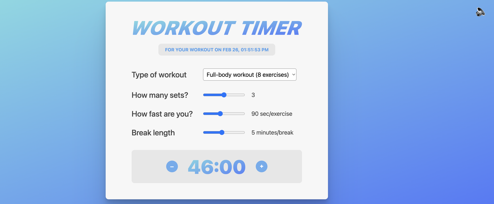

# Workout Timer - React Performance Optimization Demo

A fitness workout timer application built with React that demonstrates performance optimization techniques using `React.memo`, `useMemo`, and the React DevTools Profiler.



## 🎯 Purpose

This project is a practical demonstration of:

- Identifying performance bottlenecks using React DevTools Profiler
- Optimizing component re-renders with `React.memo`
- Memoizing expensive computations with `useMemo`
- Managing component props efficiently to prevent unnecessary renders

## ✨ Features

- **Dynamic Workout Planning**: Choose from 5 different workout types
- **Customizable Parameters**:
  - Number of sets (1-5)
  - Exercise speed (30-180 seconds per exercise)
  - Break duration (1-10 minutes)
- **Real-time Duration Calculator**: Automatically calculates total workout time
- **Sound Effects**: Toggle-able click sounds for interactions
- **Live Clock**: Shows current date and time that updates every second

## 🚀 Performance Optimizations

### 1. React.memo Implementation

**Components wrapped with memo:**

- `Calculator` component - Prevents re-renders when parent updates but props remain the same
- `ToggleSounds` component - Only re-renders when `allowSound` or `setAllowSound` changes

```javascript
export default memo(Calculator);
export default memo(ToggleSounds);
```

**Why it matters:** Without `memo`, these components would re-render every second when the clock updates in the parent `App` component, even though their props haven't changed.

### 2. useMemo for Expensive Calculations

**Memoized workouts array:**

```javascript
const workouts = useMemo(() => {
  return [
    { name: "Full-body workout", numExercises: partOfDay === "AM" ? 9 : 8 },
    // ... other workouts
  ];
}, [partOfDay]);
```

**Why it matters:** The workouts array is only recalculated when `partOfDay` changes (AM/PM), not on every second when the clock ticks. This prevents breaking `React.memo` optimization on the Calculator component.

### 3. Using React DevTools Profiler

**How to identify performance issues:**

1. Install [React Developer Tools](https://react.dev/learn/react-developer-tools)
2. Open the **Profiler** tab in DevTools
3. Click the record button
4. Interact with the app (toggle sounds, change workout settings)
5. Stop recording and analyze the flame graph

**What to look for:**

- Components that render frequently without prop changes
- Long render times (yellow/red in flame graph)
- Cascading renders that could be prevented

## 🛠️ Getting Started

### Installation

```bash
npm install
```

### Development

```bash
npm start
```

Open [http://localhost:3000](http://localhost:3000) to view it in your browser.

### Build

```bash
npm run build
```

Builds the app for production to the `build` folder.

## 📁 Project Structure

```
src/
├── App.js              # Main component with clock and state
├── Calculator.js       # Workout calculator (memoized)
├── ToggleSounds.js     # Sound toggle button (memoized)
├── ClickSound.m4a      # Audio file for click sounds
├── index.js            # Entry point
└── index.css           # Styles
```

## 🔍 Key Learning Points

### Performance Problem Without Optimization

Without `memo` and `useMemo`:

- Every 1-second clock update causes ALL child components to re-render
- The `workouts` array is recreated every second
- Calculator re-renders unnecessarily, even with same props
- Can lead to lag and poor UX with more complex components

### Solution Applied

With optimizations:

- Child components only re-render when their props actually change
- Workouts array only recreates when time switches between AM/PM
- Clock updates don't trigger calculator re-renders
- Smooth, efficient performance

## 📚 React Optimization Techniques Demonstrated

1. **React.memo** - Prevents re-renders of functional components when props haven't changed
2. **useMemo** - Memoizes expensive calculations/object creation
3. **useEffect** - Manages side effects (clock interval) properly with cleanup
4. **React DevTools Profiler** - Identifies and measures render performance

## 🔗 Related Resources

- [React.memo Documentation](https://react.dev/reference/react/memo)
- [useMemo Hook](https://react.dev/reference/react/useMemo)
- [React DevTools Profiler](https://react.dev/learn/react-developer-tools)
- [Optimizing Performance](https://react.dev/learn/render-and-commit)

## 📝 License

MIT
